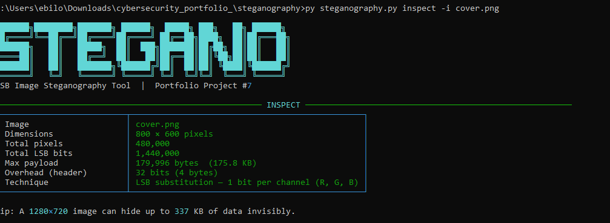
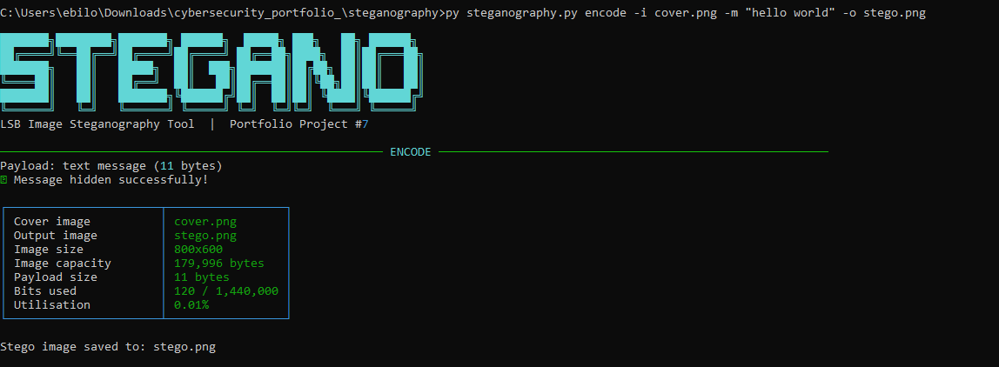
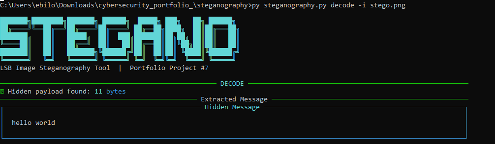

<h1 align="center">
  🕵️ Image Steganography Tool
</h1>

<p align="center">
  <b>Hide secret messages inside images — invisibly.</b><br/>
  LSB steganography with optional AES-256 encryption.
</p>

<p align="center">
  
  
  
  
</p>

---

## 📸 Screenshots

### 1. Inspecting cover image capacity


### 2. Encoding a secret message


### 3. Decoding the hidden message


---

## 🧠 How LSB Steganography Works

Every pixel in an image has three colour channels — **Red**, **Green**, **Blue** — each stored as an 8-bit integer (0–255).

The **Least Significant Bit** (the final bit) contributes only ±1 to the colour value. Replacing it with a secret bit is completely invisible to the human eye.

```
Original:        10110110  (182)
                         ^
After embed '1': 10110111  (183)  ← difference of just 1/255
After embed '0': 10110110  (182)  ← unchanged
```

A single **1920×1080** image can silently carry up to **≈ 776 KB** of hidden data.

---

## 🏗️ Architecture

```
steganography/
├── steganography.py    ← CLI entry point (Rich interface)
├── lsb_engine.py       ← Core encode/decode logic
├── crypto_utils.py     ← AES-256 / Fernet encryption layer
├── requirements.txt
└── screenshots/
    ├── 01_inspect.png
    ├── 02_encode.png
    └── 03_decode.png
```

### Payload layout inside the image

```
[ 32-bit length header ] [ payload bits ... ] [ remaining pixels untouched ]
```

The 4-byte header stores the exact payload length — no delimiter scanning needed.

---

## ⚙️ Setup

```cmd
cd steganography
pip install -r requirements.txt
```

---

## 🚀 Usage

### Inspect image capacity
```cmd
python steganography.py inspect -i cover.png
```

### Hide a text message
```cmd
python steganography.py encode -i cover.png -m "Meet me at the bridge" -o stego.png
```

### Hide a message with encryption
```cmd
python steganography.py encode -i cover.png -m "Top secret" -o stego.png -p mypassword
```

### Hide any file
```cmd
python steganography.py encode -i cover.png -f secret.txt -o stego.png
```

### Extract a message
```cmd
python steganography.py decode -i stego.png
```

### Extract an encrypted message
```cmd
python steganography.py decode -i stego.png -p mypassword
```

### Save extracted payload to file
```cmd
python steganography.py decode -i stego.png -o recovered.txt
```

---

## 🔐 Security Design

| Layer | Purpose |
|---|---|
| **LSB Steganography** | Hides the *existence* of the message |
| **AES-256 (Fernet)** | Protects the *content* if the image is discovered |
| **PBKDF2-SHA256** | Derives a strong encryption key from your password |
| **Random salt (16B)** | Prevents rainbow table / pre-computation attacks |

> ⚠️ Always use **PNG or BMP** as your cover image. JPEG recompression destroys the hidden bits.

---

## 🛠️ Skills Demonstrated

- Bit-level binary manipulation
- Image processing with **Pillow**
- **AES-256** symmetric encryption
- **PBKDF2** key derivation (390,000 iterations)
- CLI design with **argparse**
- Rich terminal UI with **Rich**
- Binary framing with Python `struct`

---

## 👨‍💻 Author:

## Egwu Donatus Achema
Cybersecurity Analyst | Python Security Tools Portfolio

**GitHub**: [@Don-cybertech](https://github.com/Don-cybertech) 

**LinkedIn**: (https://www.linkedin.com/in/egwu-donatus-achema-8a9251378/)

**Gmail**: (donatusachema@gmail.com)

Part of: Cybersecurity Portfolio
